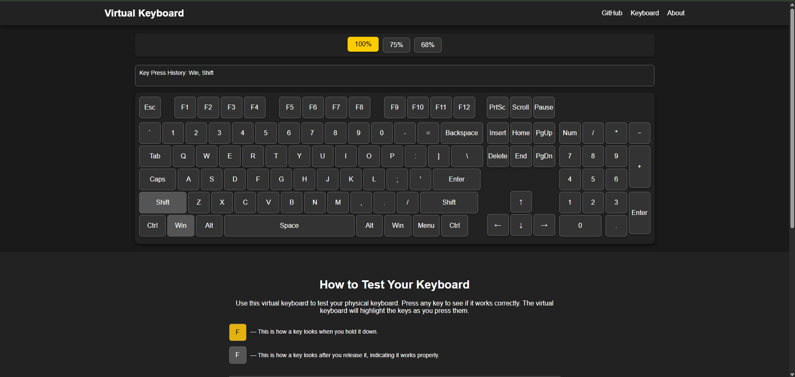

# 🧠 Virtual Keyboard

A virtual keyboard for testing key presses in the browser. Keys are highlighted in real time as you type.

## 🔍 Preview



## 🔧 Technologies

- [Vite](https://vitejs.dev/) – fast build tool
- HTML, CSS, Vanilla JS – no frameworks

## 🚀 Getting Started

### Development Mode

```bash
npm install
npm run dev
